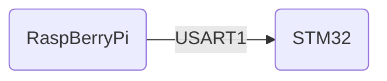
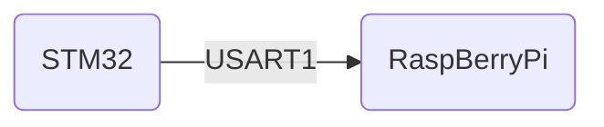

# 通信协议说明

## 接收数据

### 帧格式

|  字节  |   类型    |        可选值        | 说明 |
| :----: | :-------: | :------------------: | ---- |
| byte0  |   帧头    |         0xAA         |      |
| byte1  | 设备地址  |      0x01-0xFF       |      |
| byte2  | 命令类型  | 不同设备对应不同指令 |      |
| byte3  |   帧长    |   用户数据实际长度   |      |
| byte4  | 用户数据0 |                      |      |
| byte5  | 用户数据1 |                      |      |
| byte6  | 用户数据2 |                      |      |
| byte7  | 用户数据3 |                      |      |
| byte8  | 用户数据4 |                      |      |
| byte9  | 用户数据5 |                      |      |
| byte10 |  校验和   |  前10项和对255取余   |      |
| byte11 |   帧尾    |         0xDD         |      |

### 设备地址

| 地址 |   设备   |
| :--: | :------: |
| 0x01 |  机器人  |
| 0x02 | 吊舱云台 |
| 0x03 |  机械臂  |
| 0x04 |   电源   |
| 0x05 |   IMU    |
| 0x06 |  传感器  |

### 机器人(0x01) 

| 命令类型 |           用户数据            |    说明    |
| :------: | :---------------------------: | :--------: |
|   0x00   | 0x00,0x00,0x00,0x00,0x00,0x00 |    停止    |
|   0x01   | 0x00,0x00,0x00,0x00,0x00,0x00 |    前进    |
|   0x02   | 0x00,0x00,0x00,0x00,0x00,0x00 |    后退    |
|   0x03   | 0x00,0x00,0x00,0x00,0x00,0x00 |    右上    |
|   0x04   | 0x00,0x00,0x00,0x00,0x00,0x00 |    左上    |
|   0x05   | 0x00,0x00,0x00,0x00,0x00,0x00 |    右下    |
|   0x06   | 0x00,0x00,0x00,0x00,0x00,0x00 |    左下    |
|   0x07   | 0x00,0x00,0x00,0x00,0x00,0x00 |    右移    |
|   0x08   | 0x00,0x00,0x00,0x00,0x00,0x00 |    左移    |
|   0x09   | 0x00,0x00,0x00,0x00,0x00,0x00 | 原地右旋转 |
|   0x0A   | 0x00,0x00,0x00,0x00,0x00,0x00 | 原地左旋转 |
|          |                               |            |
|   0x20   |                               |  运行速度  |
|          |                               |            |
|   0xFF   | 0x00,0x00,0x00,0x00,0x00,0x00 |    握手    |

**示例**

前进：`AA 01 01 00 00 00 00 00 00 00 01 DD `

### 云台(0x02) 

| 命令类型 |                用户数据                |   说明   |
| :------: | :------------------------------------: | :------: |
|   0x00   |     0x00,0x00,0x00,0x00,0x00,0x00      |   归中   |
|   0x01   | 0x01:可见光，0x02:红外，0x03:可见+红外 | 视频模式 |
|   0x02   | yaw(2 Bytes), pitch(2Bytes),0x00,0x00  | 角度控制 |
|   0x03   | zoom(1bytes), 0x00,0x00,0x00,0x00,0x00 | 焦距控制 |

### 电源(0x04) 

| 命令类型 |                           用户数据                           |        说明        | 命令               |
| :------: | :----------------------------------------------------------: | :----------------: | ------------------ |
|   0x00   |                0x00,0x00,0x00,0x00,0x00,0x00                 |        测试        | AT\r\n             |
|   0x01   |                0x00,0x00,0x00,0x00,0x00,0x00                 |    得到输入电压    | AT+V\r\n           |
|   0x02   |                0x00,0x00,0x00,0x00,0x00,0x00                 |    得到输入电流    | AT+C\r\n           |
|   0x03   |                0x00,0x00,0x00,0x00,0x00,0x00                 |    得到当前功率    | AT+P\r\n           |
|   0x04   |             MaxC(1byte),0x00,0x00,0x00,0x00,0x00             |  设置最大工作电流  | AT+MAXC<+PRA>\r\n  |
|   0x05   | 0x01:电压过大 0x02:电压过小 0x03:电流过大 0x04:电流过小 0x05:功率过大  |    设置报警模式    | AT+MODE<+PRA>\r\n  |
|   0x06   |                       0.000-36.000(10)                       | 设置电压过大报警值 | AT+OVERVERR<+PRA>  |
|   0x07   |                       0.000-36.000(1)                        | 设置电压过小报警值 | AT+UNDERVERR<+PRA> |
|   0x08   |                       0.000-40.000(10)                       | 设置电流过大报警值 | AT+OVERCERR<+PRA>  |
|   0x09   |                       0.000-40.000(1)                        | 设置电流过小报警值 | AT+UNDERCERR<+PRA> |
|   0x0A   |                      0.000-1080.000(10)                      | 设置功率过大报警值 | AT+OVERPERR<+PRA>  |

## 发送数据

### 帧格式

| 字节  |        说明         | 可选值 |
| :---: | :-----------------: | :----: |
| byte0 |        帧头         |  0xAA  |
| byte1 | 机器人实际速度低8位 |        |
| byte2 | 机器人实际速度高8位 |        |
| byte3 |   机器人电压低8位   |        |
| byte4 |   机器人电压高8位   |        |
| byte5 |       校验位        |        |
| byte6 |        帧尾         |  0xDD  |