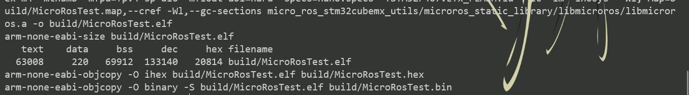

# 在Windows(10) 系统下搭建MicroROS环境


## 环境

1. 安装STM32CubeMX 软件，项目生成需要通过该软件生成cmake项目
2. 安装VSCode
3. 下载windows下make编译工具 [xpack-dev-tools](https://github.com/xpack-dev-tools/windows-build-tools-xpack/releases)，并设置环境变量
4. 下载[Arm GNU Toolchain](https://developer.arm.com/tools-and-software/open-source-software/developer-tools/gnu-toolchain)，并设置环境变量

## 测试

```shell
$ git clone --recursive https://github.com/yunke120/microros-test.git
$ cd .\microros-test\
$ make
```

