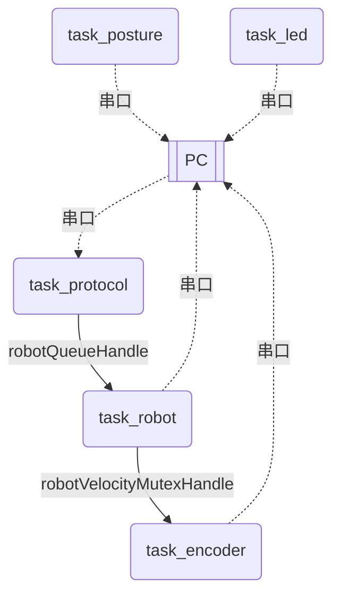

## STM32F407VET6外设分配

| 外设名称 |      对应引脚      |         说明          | 配置                  |
| :------: | :----------------: | :-------------------: | --------------------- |
|  USART1  |      PA9,PA10      | 未使用，可与Linux通信 |                       |
|  USART2  |      PA2,PA3       |     电源管理模块      | 9600,8,1,N            |
|  USART3  |      PD8,PD9       |         通信          | 115200,8,1,N          |
|          |                    |                       |                       |
|          |                    |                       |                       |
|   TIM1   |  Timebase Source   |   开启FreeRTOS需要    |                       |
|   TIM2   |      PA15,PB3      |      编码器接口       | 双边沿触发            |
|   TIM3   |      PA6,PA7       |      编码器接口       | 双边沿触发            |
|   TIM4   |      PB6,PB7       |      编码器接口       | 双边沿触发            |
|   TIM5   |      PA0,PA1       |      编码器接口       | 双边沿触发            |
|   TIM8   |  PC6,PC7,PC8,PC9   | PWM输出，调节电机转速 | arr=16799,psc=0,10KHZ |
|          |                    |                       |                       |
| ~~ADC1~~ |    ~~PB0(IN8)~~    |   ~~测量输入电压~~    | ~~DMA2 Stream0~~      |
|   ADC1   |     PC1(IN11)      |      测量MQ2输出      | DMA2 Stream0          |
|          |                    |                       |                       |
|          |     PA13,PA15      |      SWD下载接口      |                       |
|          |     PB12,PB13      |    右前轮控制引脚     |                       |
|          |      PA8,PC12      |    左前轮控制引脚     |                       |
|          |      PB14,PC0      |    右后轮控制引脚     |                       |
|          |     PD10,PD12      |    左后轮控制引脚     |                       |
|          |   PD13,PD14,PD15   |        三色LED        |                       |
|          |        PD11        |        蜂鸣器         |                       |
|          |  PD4,PD5,PD6,PD7   |      OLED(软SPI)      |                       |
|          |      PB8,PB9       |    MPU6050(软IIC)     |                       |
|   总计   | (18+40)/100=58/100 |                       |                       |

## 协议

|  字节  |   类型    |        可选值        | 说明 |
| :----: | :-------: | :------------------: | ---- |
| byte0  |   帧头    |         0xAA         |      |
| byte1  | 设备地址  |      0x01-0xFF       |      |
| byte2  | 命令类型  | 不同设备对应不同指令 |      |
| byte3  |   帧长    |   用户数据实际长度   |      |
| byte4  | 用户数据0 |                      |      |
| byte5  | 用户数据1 |                      |      |
| byte6  | 用户数据2 |                      |      |
| byte7  | 用户数据3 |                      |      |
| byte8  | 用户数据4 |                      |      |
| byte9  | 用户数据5 |                      |      |
| byte10 |  校验和   |  前10项和对255取余   |      |
| byte11 |   帧尾    |         0xDD         |      |

### 设备地址

| 地址 |   设备   |
| :--: | :------: |
| 0x01 |  机器人  |
| 0x02 | 吊舱云台 |
| 0x03 |  机械臂  |
| 0x04 |   电源   |
| 0x05 |   IMU    |
| 0x06 |  传感器  |

### 命令类型 PC->Robot

#### 机器人(0x01) 

| 命令类型 |           用户数据            |    说明    |
| :------: | :---------------------------: | :--------: |
|   0x00   | 0x00,0x00,0x00,0x00,0x00,0x00 |    停止    |
|   0x01   | 0x00,0x00,0x00,0x00,0x00,0x00 |    前进    |
|   0x02   | 0x00,0x00,0x00,0x00,0x00,0x00 |    后退    |
|   0x03   | 0x00,0x00,0x00,0x00,0x00,0x00 |    右上    |
|   0x04   | 0x00,0x00,0x00,0x00,0x00,0x00 |    左上    |
|   0x05   | 0x00,0x00,0x00,0x00,0x00,0x00 |    右下    |
|   0x06   | 0x00,0x00,0x00,0x00,0x00,0x00 |    左下    |
|   0x07   | 0x00,0x00,0x00,0x00,0x00,0x00 |    右移    |
|   0x08   | 0x00,0x00,0x00,0x00,0x00,0x00 |    左移    |
|   0x09   | 0x00,0x00,0x00,0x00,0x00,0x00 | 原地右旋转 |
|   0x0A   | 0x00,0x00,0x00,0x00,0x00,0x00 | 原地左旋转 |
|          |                               |            |
|          |                               |            |
|          |                               |            |
|          |                               |            |
|   0xFF   | 0x00,0x00,0x00,0x00,0x00,0x00 |    握手    |

**示例**

前进：`AA 01 01 00 00 00 00 00 00 00 01 DD `

#### 云台(0x02) 

| 命令类型 |                用户数据                |   说明   |
| :------: | :------------------------------------: | :------: |
|   0x00   |     0x00,0x00,0x00,0x00,0x00,0x00      |   归中   |
|   0x01   | 0x01:可见光，0x02:红外，0x03:可见+红外 | 视频模式 |
|   0x02   | yaw(2 Bytes), pitch(2Bytes),0x00,0x00  | 角度控制 |
|   0x03   | zoom(1bytes), 0x00,0x00,0x00,0x00,0x00 | 焦距控制 |

#### 电源(0x04) 

| 命令类型 |                           用户数据                           |        说明        | 命令               |
| :------: | :----------------------------------------------------------: | :----------------: | ------------------ |
|   0x00   |                0x00,0x00,0x00,0x00,0x00,0x00                 |        测试        | AT\r\n             |
|   0x01   |                0x00,0x00,0x00,0x00,0x00,0x00                 |    得到输入电压    | AT+V\r\n           |
|   0x02   |                0x00,0x00,0x00,0x00,0x00,0x00                 |    得到输入电流    | AT+C\r\n           |
|   0x03   |                0x00,0x00,0x00,0x00,0x00,0x00                 |    得到当前功率    | AT+P\r\n           |
|   0x04   |             MaxC(1byte),0x00,0x00,0x00,0x00,0x00             |  设置最大工作电流  | AT+MAXC<+PRA>\r\n  |
|   0x05   | 0x01:电压过大 0x02:电压过小 0x03:电流过大 0x04:电流过小 0x05:功率过大  |    设置报警模式    | AT+MODE<+PRA>\r\n  |
|   0x06   |                       0.000-36.000(10)                       | 设置电压过大报警值 | AT+OVERVERR<+PRA>  |
|   0x07   |                       0.000-36.000(1)                        | 设置电压过小报警值 | AT+UNDERVERR<+PRA> |
|   0x08   |                       0.000-40.000(10)                       | 设置电流过大报警值 | AT+OVERCERR<+PRA>  |
|   0x09   |                       0.000-40.000(1)                        | 设置电流过小报警值 | AT+UNDERCERR<+PRA> |
|   0x0A   |                      0.000-1080.000(10)                      | 设置功率过大报警值 | AT+OVERPERR<+PRA>  |

### 命令类型 Robot->PC

#### 机器人(0x01) 

| 命令类型 |                 用户数据                 |      说明      |
| :------: | :--------------------------------------: | :------------: |
|   0x00   |      0x00,0x00,0x00,0x00,0x00,0x00       |      预留      |
|   0x01   | V_X(2 bytes), V_Y(2 bytes), V_Z(2 bytes) | 机器人运动速度 |
|   0x02   |          X Y Z角度，每个2bytes           |      IMU       |
|   0x03   |   Voltage(2Bytes),0x00,0x00,0x00,0x00    |    电池电压    |
|   0x04   |     MQ2(2Bytes),0x00,0x00,0x00,0x00      |  有害气体浓度  |
|          |                                          |                |
|          |                                          |                |

## 线程间通信

## 接线

1. 图传机载端串口与控制板连接
   - PD8 -> 5号，PD9 -> 4号，GND->6号

2. 图传地面端与USB转TTL连接
   - 黑色->GND，白色->RXD，棕色->TXD

3. 电源管理模块(INA226)与控制板接线
   - 红色->5V，黑色->GND，白色(TX)->PA3，棕色(RX)->PA2

## 错误解决

1. 显示黑屏

   原因是视频解码器解码故障，可以通过一台交换机或者路由器将电脑，摄像头，视频解码器连接起来，(电脑需要改为192.168.1.xxx网段)，首先排查摄像头的问题，通过vlc或者III-Master打开网络流(rtsp://192.168.1.119/554)，如果有显示，则摄像头没有问题；其次排查视频解码器问题，通过浏览器打开(http://192.168.2.169/，账户密码都是admin)，此时会进去解码器后台，可以观察到解码器的状态是不是正常，经测试，黑屏大概2分钟会恢复显示。
